<h1>Compose animations standard</h1>

<h2>Table of contents</h2>

<!-- TOC -->
  * [Motivation](#motivation)
  * [Compose animations cheat sheet](#compose-animations-cheat-sheet)
  * [NavHost transitions between screens](#navhost-transitions-between-screens)
  * [Motion layout](#motion-layout)
  * [Shared elements transition](#shared-elements-transition)
  * [Guidelines](#guidelines)
    * [Duration](#duration)
    * [Easing](#easing)
    * [Transformation](#transformation)
    * [Transition patterns](#transition-patterns)
<!-- TOC -->

## Motivation

Animations can make your app more **engaging**, **interactive**, and **visually appealing**. They can also help to
improve the user experience by providing feedback and making transitions between screens smoother. Jetpack Compose makes
it easy to implement the animations into the app with just a few lines of code, even if you are new to animations.

This document covers basic common animations (shown in the cheat sheet) and also a little more complex cases which
are common or could appear in our projects. Hopefully, with its simplicity, this document will engage you to implement
animations in your project.

## Compose animations cheat sheet


**More on: https://developer.android.com/jetpack/compose/animation/introduction**

## NavHost transitions between screens

To set transitions for all navigation destinations inside `NavHost` define `enterTransition` and `exitTransition`. By
default `NavHost` uses `fadeIn(animationSpec = tween(700))` for enter transition
and `fadeOut(animationSpec = tween(700))` for exit transition. Optionally, you can also set the `popEnterTransition`
and `popExitTransition`, by default these values are same as `enterTransition` and `exitTransition`. On the other hand,
if you want to set transition for a specific screen, you need to define transitions at the `composable` function which
is placed inside `NavGraphBuilder` scope.

For enter transitions you can choose between 4 categories:

- fade: `fadeIn`
- scale: `scaleIn`
- slide: `slideIn`, `slideInHorizontally`, `slideInVertically`
- expand: `expandIn`, `expandHorizontally`, `expandVertically`

For exit transitions you can also choose between the same 4 categories which represent the opposite transition effects:

- fade: `fadeOut`
- scale: `scaleOut`
- slide: `slideOut`, `slideOutHorizontally`, `slideOutVertically`
- shrink: `shrinkOut`, `shrinkHorizontally`, `shrinkVertically`

For combining enter transitions you can simply add them up with `+` operator, thanks to:

``` kotlin
sealed class EnterTransition {
    // ...
    operator fun plus(enter: EnterTransition): EnterTransition {
        return EnterTransitionImpl(
            TransitionData(
                fade = data.fade ?: enter.data.fade,
                slide = data.slide ?: enter.data.slide,
                changeSize = data.changeSize ?: enter.data.changeSize,
                scale = data.scale ?: enter.data.scale
            )
        )
    }
    // ...
}
```

For example: `fadeIn() + scaleIn()`. The order of the transitions being combined does not matter, as these
transitions will start simultaneously. The order of applying transforms from these enter transitions (if defined)
is: alpha and scale first, shrink or expand, then slide. The same applies to exit transitions.

``` kotlin
NavHost(
    navController = navController,
    startDestination = Screens.ScreenA.route,
    // Transitions are applied for all defined routes for its NavGraph
    enterTransition = {
        slideIntoContainer(
            towards = AnimatedContentTransitionScope.SlideDirection.Left,
            animationSpec = tween(durationMillis = 500)
        )
    },
    exitTransition = {
        slideOutOfContainer(
            towards = AnimatedContentTransitionScope.SlideDirection.Left,
            animationSpec = tween(durationMillis = 500)
        )
    },
    popEnterTransition = {
        slideIntoContainer(
            towards = AnimatedContentTransitionScope.SlideDirection.Right,
            animationSpec = tween(durationMillis = 500)
        )
    },
    popExitTransition = {
        slideOutOfContainer(
            towards = AnimatedContentTransitionScope.SlideDirection.Right,
            animationSpec = tween(durationMillis = 500)
        )
    }
) {
    // NavGraphBuilder scope
    composable(
        route = Screens.ScreenA.route,
        // These transitions are applied only for this route
        enterTransition = { fadeIn() },
        exitTransition = { fadeOut() }
        // If not explicity defined, pop transitions are the same as enter and exit transition
    ) { Screen("Screen A") }
    composable(route = Screens.ScreenB.route) { Screen("Screen B") }
    composable(route = Screens.ScreenC.route) { Screen("Screen C") }
}
```

## Motion layout

## Shared elements transition

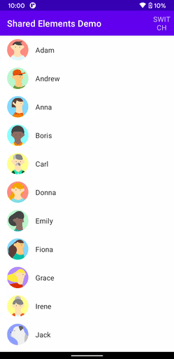
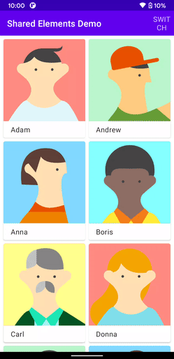

`TODO: Shared element transitions are currently in development`

For now, you can use [this](https://github.com/mxalbert1996/compose-shared-elements) library.

## Guidelines

These guidelines will guide you how to apply animations appropriately in terms of duration (how long a transition
lasts), easing (acceleration over time) and transformation (how UI element takes a different form). Also, for common use
cases there are some transition patterns which can be useful while building your interactive app.

### Duration

When elements change their state or position, the duration of the animation should be slow enough to give users the
possibility to notice the change, but at the same time quick enough not to cause waiting. If the animation or transition
speed is not appropriate it will result with poor UX, which counters your idea to improve the existing app. To achieve
better UX, choosing the right combination of duration and easing will produce with smooth and responsive transitions.

<figure style="text-align:center">
    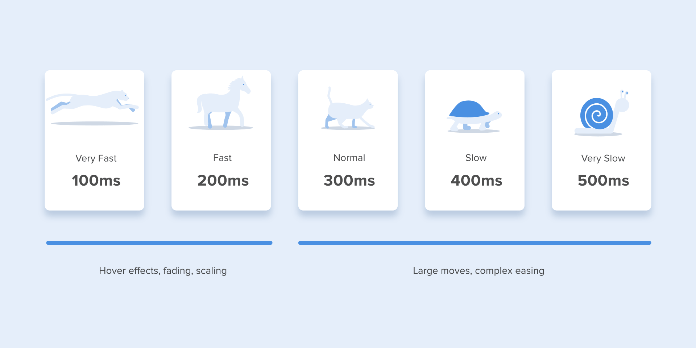
    <figcaption>
      Suggested durations
    </figcaption>
</figure>

[Numerous researches](https://valhead.com/2016/05/05/how-fast-should-your-ui-animations-be/) have discovered that
optimal speed for interface animation is between 200 and 500 ms. These figures
are based on the particular qualities of the human brain. Any animation shorter than 100 ms is instantaneous and won’t
be recognized at all. Whereas the animation longer than 1 second would convey a sense of delay and thus be boring for
the user.

On the mobile devices, [Material Design Guidelines](https://m2.material.io/design/motion/speed.html#duration) also
suggests limiting the duration of animation to 200–300 ms. As for tablets, the duration should be longer by 30% — around
400–450 ms. The reason is simple: the size of the screen is bigger so objects overcome the longer path when they change
position. On wearables, the duration should be accordingly 30% shorter — around 150–200 ms, because on a smaller screen
the distance to travel is shorter.

<div style="display:flex; justify-content:start">
  <figure>
    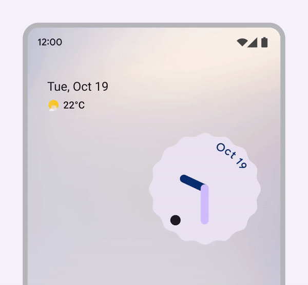
    <figcaption>
      <b style="color:green">Do: </b>A transition with a well tuned duration is quick and easy to follow
    </figcaption>
  </figure>

  <figure>
    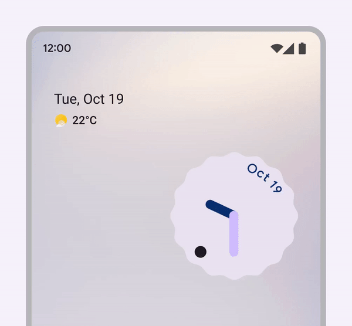
    <figcaption>
      <b style="color:red">Don't: </b>A transition with a well tuned duration is quick and easy to follow
    </figcaption>
  </figure>
</div>


**Durations are chosen based on these criteria:**

**Transition size**

Transitions that cover small areas of the screen have short durations, while large areas have long durations. Scaling
duration with the size of a transition gives a consistent sense of speed.

<div style="display:flex; justify-content:start">
  <figure>
    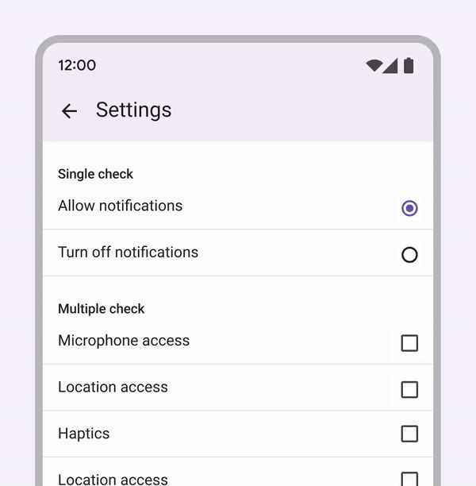
    <figcaption>
      This transition covers a small area with a short 200ms duration
    </figcaption>
  </figure>

  <figure>
    
    <figcaption>
      This transition covers a large area with a short 500ms duration
    </figcaption>
  </figure>
</div>

**Enter vs exit transitions**

**Transitions that exit**, dismiss or collapse an element **use shorter durations**. Exit transitions are faster because
they require less attention than the user's next task.

**Transitions that enter** or remain persistent on the screen **use longer durations**. This helps users focus attention
on what's new on the screen.

<figure>
    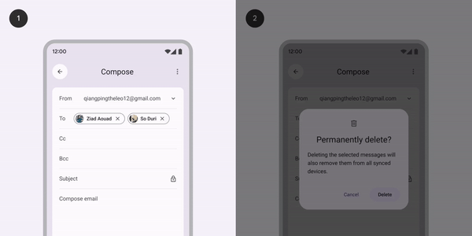
    <figcaption>
      <b>1)</b> An Enter transition has a long duration of 500ms<br>
      <b>2)</b> An Exit transition has a short duration of 200ms
    </figcaption>
</figure>

### Easing

Easing helps to make the movement of the object more natural. It’s one of the essential principles of the animation. For
the animation not to look mechanical and artificial, the object should move with some acceleration or deceleration —
just like all live objects in the physical world. So it is suggested to avoid linear motion and use the more natural
ones.

<figure style="text-align:center">
    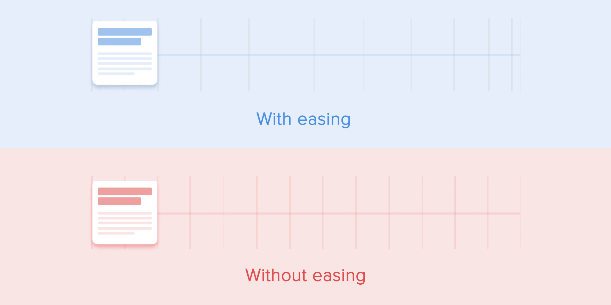
    <figcaption>
      Animation with easing looks more natural compared to the linear one
    </figcaption>
</figure>

There are different types of motion of UI elements, but the most common ones are:

<div style="display:flex; justify-content:center">
  <figure>
    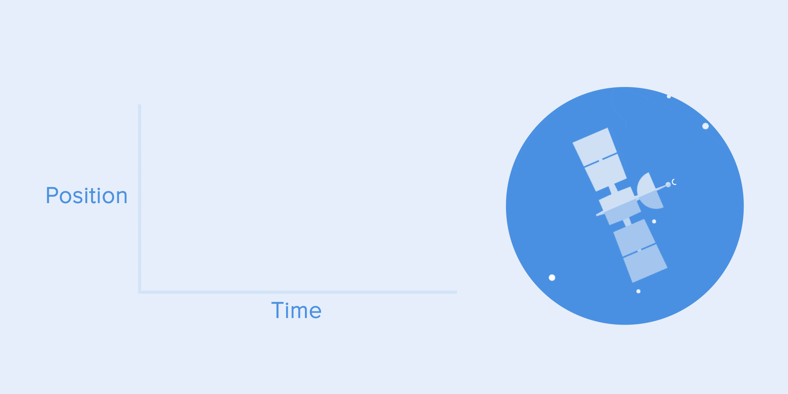
    <figcaption>
      Linear motion or constant speed motion
    </figcaption>
  </figure>

  <figure>
    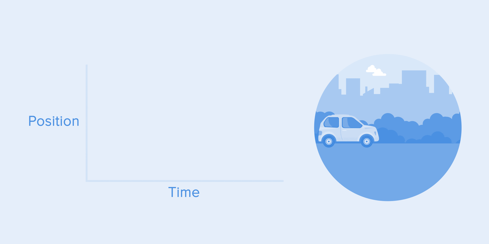
    <figcaption>
      Ease-in or acceleration motion
    </figcaption>
  </figure>

  <figure>
    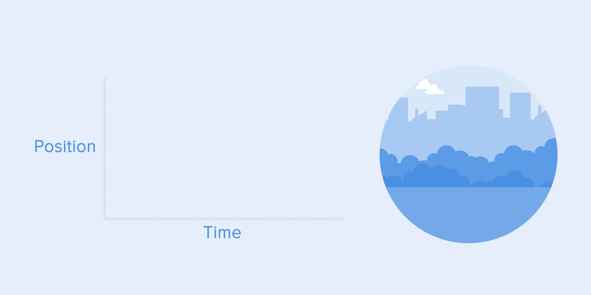
    <figcaption>
      Ease-out or deceleration motion
    </figcaption>
  </figure>

  <figure>
    
    <figcaption>
      Ease-in-out or standard motion
    </figcaption>
  </figure>
</div>

Real mobile examples when using ease motions:

<div style="display:flex; justify-content:center">
  <figure>
    
    <figcaption>
      Acceleration curve for throwing the card out of the screen
    </figcaption>
  </figure>

  <figure>
    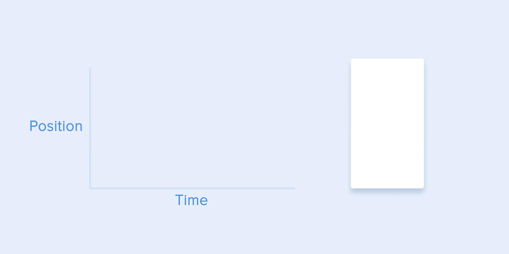
    <figcaption>
      Deceleration curve for a nice show-up
    </figcaption>
  </figure>

  <figure>
    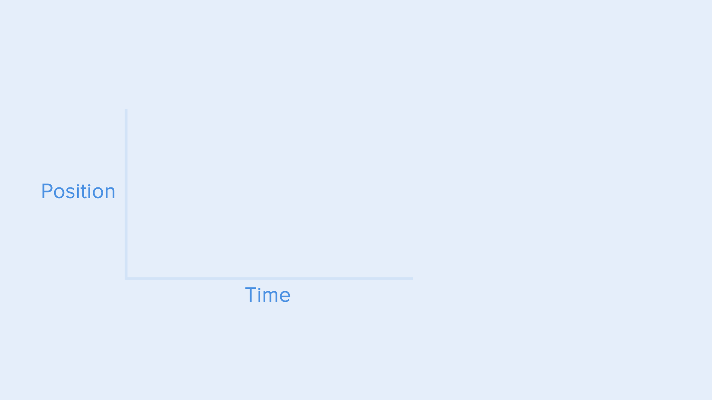
    <figcaption>
      The navigation drawer hides from the screen with the standard curve
    </figcaption>
  </figure>
</div>

### Transformation

https://m2.material.io/design/motion/choreography.html#transformation

### Transition patterns

https://m3.material.io/styles/motion/transitions/transition-patterns

- Container transform
- Forward and backward
- Lateral
- Top level
- Enter and exit
- Skeleton loaders

https://m2.material.io/design/motion/understanding-motion.html#principles
https://m3.material.io/styles/motion/overview
https://uxdesign.cc/the-ultimate-guide-to-proper-use-of-animation-in-ux-10bd98614fa9
